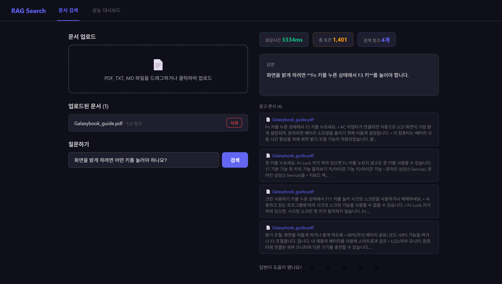
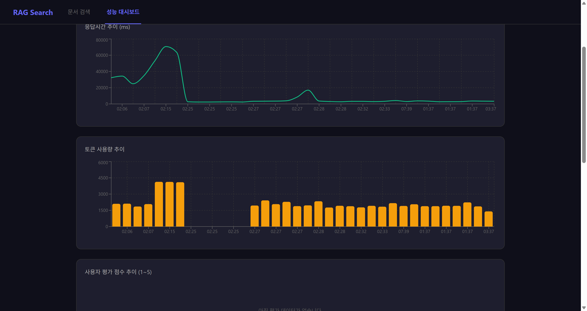

# rag_search

PDF·TXT·MD 문서를 올리면 임베딩해 벡터 DB에 저장하고, 질문하면 관련 청크를 찾아 LLM이 근거 기반으로 답하는 **RAG 문서 검색 서비스**입니다.

### 🔗 [배포된 서비스 바로가기](https://ai-search-practice-bk4z.vercel.app)

> 무료 호스팅이라 **첫 접속 시 서버를 깨우는 데 최대 2분** 걸릴 수 있습니다. 두 번째부터는 2초 내외입니다.

React → Spring Boot → Python FastAPI → OpenAI / Groq / Qdrant Cloud / Supabase 로 이어지는 마이크로서비스 구조입니다. 로컬에서는 `.env` 설정만으로 Ollama + 임베디드 Qdrant + H2 의 완전 로컬 스택으로도 동작합니다.

---



질문하면 관련 청크를 찾아 LLM이 답하고, **근거가 된 문서 조각과 응답시간·토큰 수를 함께** 보여줍니다. 답변은 SSE로 스트리밍됩니다.

<details>
<summary>성능 대시보드 (펼치기)</summary>



쿼리별 응답시간·토큰 사용량을 기록해 추이를 봅니다.
화면의 평균 응답시간은 IPv6 문제를 고치기 전 기록까지 포함한 누적값입니다.

</details>

---

## 이 프로젝트에서 봐주셨으면 하는 것

기능을 나열하기보다, **문제를 어떻게 찾아내고 무엇을 근거로 결정했는지**를 남기려 했습니다.

### 1. 검색 응답 4,485ms → 53ms (85배)

검색이 느려서 단계별로 계측했더니 내부 합계는 2,077ms인데 바깥에서 재면 4,132ms였습니다. **설명되지 않는 2초가 두 군데** 있었고, 크기가 비슷해 같은 원인이라 보고 좁혀 들어갔습니다.

```
localhost  로 호출 : 2058ms, 2084ms, 2089ms
127.0.0.1  로 호출 :   39ms,   46ms,   37ms
연결 재사용 시      : 2091ms → 37ms → 38ms   (첫 연결만 느림)
```

Ollama와 FastAPI는 `127.0.0.1` 에만 바인딩돼 있는데 `localhost` 는 IPv6(`::1`)로 먼저 해석됩니다. **모든 요청이 IPv6 연결 실패를 2초씩 기다린 뒤 IPv4로 폴백**하고 있었습니다. 코드도 모델도 DB도 정상이었고, 주소 문자열 하나가 원인이었습니다.

### 2. RAG 품질을 숫자로 관리하는 평가 체계

"검색이 잘 되는 것 같다"를 없애고 싶어서 평가 하네스를 직접 만들었습니다. **검색 단계와 답변 단계를 분리해서 잽니다.**

| 층 | 지표 | 현재 |
|---|---|---|
| 검색 | Recall@4 / 문서 적중률 / MRR@4 | **83.3% / 100% / 0.722** |
| 답변 | 정확도 / 과잉 거절 / 환각 | **77.8% / 1 of 18 / 1 of 4** |

```bash
cd backend-ai
python evals/run_eval.py          # 검색 단계
python evals/run_answer_eval.py   # 답변 단계
python evals/reload_corpus.py     # 설정 바꾼 뒤 코퍼스 재적재
```

두 층을 나눠 잰 덕분에 **"맞는 문서를 가져오면서 그 안의 엉뚱한 청크를 고르는"** 실패 유형을 분리할 수 있었고, 그것이 청킹 개선으로 이어졌습니다.

### 3. 측정으로 뒤집은 결론들

| 처음 판단 | 측정 결과 | 어떻게 드러났나 |
|---|---|---|
| 청크 350이 최적 | **500이 더 나음** (MRR 0.688 → 0.854) | Recall이 100% 천장에 닿아 판단 불가였음. MRR 도입 후 재측정 |
| 다단 PDF엔 `setSortByPosition(false)` | **`true` 가 우세** (94.4% vs 77.8%) | 추출 텍스트를 눈으로 본 인상이었음. 끝까지 재보니 반대 |
| 업로드 시간의 97.9%가 임베딩 | 맞지만 **그중 20%는 IPv6 대기** | 계측을 한 단계 더 쪼갠 뒤 드러남 |
| 클라우드 임베딩은 한국어에 약함 | **모델 나름** (Recall 38.9% vs 83.3%) | 모델 하나만 재고 결론 낼 뻔했음 |

세 번 모두 **측정 도구를 개선하자 앞선 결론이 뒤집혔습니다.**

### 4. top_k를 늘리면 검색은 완벽해지고 답변은 무너진다

| top_k | Recall | MRR | 답변 정확도 | 과잉 거절 | 환각 |
|---|---|---|---|---|---|
| **4** | 94.4% | 0.815 | **72.2%** | 2/18 | **1/4 (25%)** |
| 8 | 94.4% | 0.815 | 72.2% | 1/18 | 1/4 (25%) |
| 10 | **100%** | 0.820 | 44.4% | **0/18** | **4/4 (100%)** |

`top_k=10` 은 **검색 지표가 전부 최고점**입니다. 검색만 재는 시스템이었다면 "완벽하게 개선했다"고 결론 냈을 것입니다. 그런데 답이 없는 질문 4개에 **전부 답을 지어냈습니다.**

후보가 많아지면 LLM 앞에 그럴듯해 보이는 조각이 늘 하나쯤 놓이고, "근거가 없으면 거절하라"는 규칙이 발동할 기회를 잃습니다. **거절 능력과 검색 범위는 반비례합니다.**

검색 실패는 "모르겠습니다"로 끝나지만 환각은 사용자를 틀린 행동으로 이끕니다. 그래서 `top_k = 4` 를 유지했습니다.

### 5. 두 저장소 사이 정합성 — 예방·감지·회복을 분리

문서 메타데이터는 H2에, 벡터는 Qdrant에 저장됩니다. 업로드가 중간에 실패하면 **주인 없는 벡터**가 남고, 검색은 컬렉션 전체를 대상으로 하므로 삭제된 문서가 계속 답변을 오염시킵니다. (실측: Qdrant 2건 vs H2 0건)

- **예방** — 실패 시 방금 저장한 벡터를 되돌리는 보상 트랜잭션. 원래 예외는 그대로 전파
- **감지** — 기동 직후 정합성 점검. **경고만** 남기고 자동 삭제하지 않음
- **회복** — `GET /api/documents/leftovers` (조회) / `POST /api/documents/cleanup` (삭제)

삭제는 되돌릴 수 없으므로 감지와 실행을 분리했습니다. 동작 검증은 **결함을 주입해** 실패 경로를 강제로 태우고, 정리 후 원래 예외가 살아서 전파되는 것까지 로그로 확인했습니다.

### 6. 임베딩 모델 3종 비교 — 품질 11%p 를 배포 가능성과 맞바꾼 결정

같은 코퍼스·같은 청킹·같은 평가셋에서 **임베딩 모델만** 바꿔 끝까지 쟀습니다.

| | bge-m3 (로컬) | 3-small | **3-large (채택)** |
|---|---|---|---|
| Recall@4 | **94.4%** | 38.9% | 83.3% |
| MRR@4 | **0.815** | 0.361 | 0.722 |
| 답변 정확도 | 72.2% | — | **77.8%** |
| 업로드(122청크) | 83.6초 | 4.7초 | **6.8초** |
| 무료 배포 | **불가능** (모델 2GB) | 가능 | **가능** |

`3-small` 만 재고 멈췄다면 **"클라우드 임베딩은 한국어에 못 쓴다"**고 적었을 것입니다.
실패 목록을 보니 이력서 질문에 노트북 설명서만 가져오고 있었고(이력서는 136청크 중 14개),
모델을 하나 더 재자 같은 질문들이 전부 통과했습니다. **표본 하나로 일반화하지 않습니다.**

그리고 v4.11 에서 **"BM25 를 붙여도 해결되지 않는다"**고 분석했던 유일한 검색 실패
(`그만둔 이유` → `계약만료`)가 **1등으로 잡혔습니다.** 어휘 격차는 검색 기법이 아니라
**임베딩의 의미 표현력** 문제였습니다. 하이브리드 검색을 먼저 만들었다면 풀리지 않았을 것입니다.

품질만 보면 `bge-m3` 가 낫습니다. 그럼에도 클라우드를 택한 것은 **`bge-m3` 로는 배포할 수 없기
때문**입니다(모델 2GB, 무료 티어 512MB — v3.4 의 OOM 이 정확히 이 벽이었습니다).
**아무도 접속할 수 없는 94.4% 보다 접속 가능한 83.3% 가 낫다**고 판단했습니다.
로컬 개발은 `.env` 한 줄로 `bge-m3` 를 그대로 씁니다.

---

## 구조

```
사용자 브라우저
    │  HTTP (REST + SSE)
    ▼
React 프론트엔드 (:3000)
    │  HTTP (REST + SSE)
    ▼
Spring Boot 메인 백엔드 (:8080)          ← 문서 메타·쿼리 로그·오케스트레이션
    │  내부 HTTP
    ├──────────────────────────────┐
    ▼                              ▼
Python AI 백엔드 (:8001)       H2 파일 DB
    │
    ├── Ollama (:11434)   임베딩 bge-m3 (1024차원) + LLM qwen2.5:3b
    └── Qdrant 임베디드    벡터 저장/검색 (backend-ai/data/qdrant)
```

**설계 원칙**: 프론트엔드는 Spring Boot하고만 통신합니다. Python AI 서비스는 Spring Boot가 내부적으로만 호출합니다.

업로드와 답변 생성은 모두 **SSE 스트리밍**입니다. 진행률과 토큰이 도착하는 대로 화면에 전달됩니다.

---

## 기술 스택

| 영역 | 기술 |
|---|---|
| Frontend | React, TypeScript, CSS Modules, Custom Hooks |
| Backend | Spring Boot 3.2, Java 17, JPA/H2, JUnit 5 + AssertJ |
| AI Backend | Python, FastAPI, pytest |
| 임베딩 | OpenAI `text-embedding-3-large` (3072차원) 또는 Ollama `bge-m3` (`EMBED_PROVIDER`) |
| LLM | Ollama `qwen2.5:3b` (로컬) 또는 Groq (`LLM_PROVIDER=groq`) |
| 벡터 DB | Qdrant 임베디드 (로컬 파일) 또는 원격 (`QDRANT_URL`) |
| 실행 | Docker Compose, PowerShell / Bash 스크립트 |

---

## 실행

### 사전 준비 (최초 1회)

```powershell
.\setup.ps1
```

Ollama 확인, 모델(`bge-m3`, `qwen2.5:3b`) 내려받기, Python 가상환경과 의존성 설치, `node_modules` 설치, `.env` 생성까지 한 번에 처리합니다. 이미 되어 있는 항목은 건너뜁니다.

### 실행

```powershell
.\start_search.ps1     # → http://localhost:3000
.\stop_search.ps1
```

```bash
# macOS / Linux
./start_search.sh
```

```bash
# Docker (호스트에 Ollama 실행 중이어야 함)
docker compose up --build
```

### 테스트

```bash
cd backend-spring && mvn test              # JUnit 5
cd backend-ai     && python -m pytest -q   # pytest
```

---

## 문서

| 문서 | 내용 |
|---|---|
| [docs/changelog.md](docs/changelog.md) | 버전별 변경 이력. **왜 그렇게 결정했는지와 측정 근거**를 함께 기록 |
| [docs/code_guide.md](docs/code_guide.md) | 코드 흐름과 파일별 역할 |
| [docs/debugging.md](docs/debugging.md) | 디버깅 방법, VS Code 설정 |
| [api.http](api.http) | API 수동 테스트 |

---

## 남은 과제

측정으로 확인했지만 아직 해결하지 못한 것들입니다.

**배포해서 알게 된 것**

- **에러 응답이 답변으로 나간다** — AI 서비스가 콜드 스타트 중일 때 호스팅이 HTML 안내 페이지를 반환하는데, Spring 이 형식 검사 없이 그대로 사용자에게 스트리밍합니다. "답이 안 나온다"보다 나쁜 실패입니다.
- **첫 방문 대기 2분** — 무료 플랜은 15분 무응답이면 잠듭니다. 서비스가 둘이라 각각 깨어나야 합니다. 안내 표시가 없어 멈춘 것처럼 보입니다.
- **설계 원칙 이탈** — "FastAPI 는 Spring 이 내부적으로만 호출한다"는 원칙이 배포에서 깨졌습니다. 무료 플랜에 내부 전용 서비스가 없어 FastAPI 가 공개됩니다.

**품질**

- **근거는 있지만 해석이 틀린 환각** — "희망 근무 지역"을 물으면 과거 재직지를 답합니다. 프롬프트 규칙("근거가 없으면 거절하라")으로는 막히지 않는 유형입니다.
- **답변이 빈 문자열로 나오는 케이스** — 답이 없는 질문 하나에서 거절도 답변도 하지 않습니다. 채점기가 이를 환각으로 세고 있어 지표도 함께 왜곡됩니다.
- **평가셋 규모** — 18문항으로는 0.02 수준의 차이를 우연과 구분할 수 없습니다.

**성능**

- **검색 시 원격 호출 2회** — `full_context_threshold` 판단용 `count()` 가 로컬 파일일 땐 0ms 였는데 원격 Qdrant 에서는 전체 지연의 30%입니다. 배포 환경(같은 대륙)에서 재측정 후 캐시 여부를 결정합니다.
